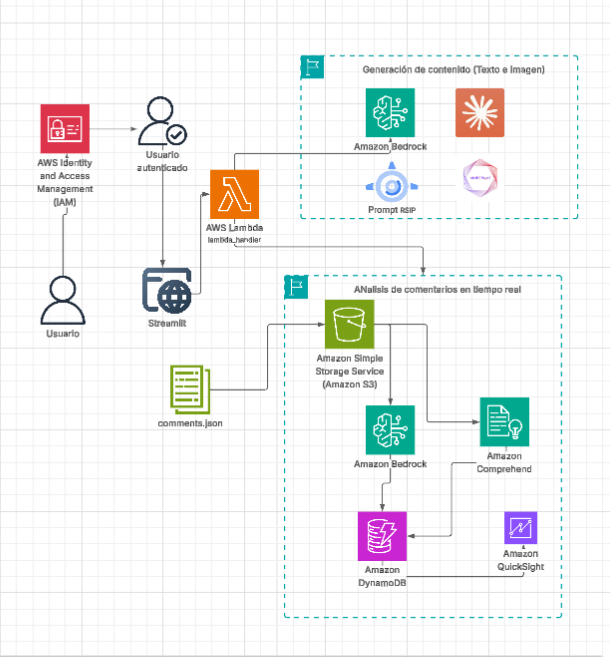

# 📘 Proyecto: IAGen para Contenido Curricular  

Este proyecto es una solución diseñada para **acelerar la generación y organización de contenidos curriculares educativos**, tomando como base documentos oficiales (ej. Currículo Nacional del Perú del MINEDU). Utiliza **Inteligencia Artificial Generativa (IAGen)** para automatizar el análisis de documentos, la extracción de competencias, capacidades y desempeños, así como la creación de recursos educativos complementarios (tablas, descripciones, actividades sugeridas).  

---

## 📌 Contexto : Revolucionando la Educación con IAGen  

El uso de **IA Generativa en educación** está transformando la manera en que los docentes preparan materiales y planificaciones.  
Actualmente, la carga de trabajo docente incluye la lectura de documentos normativos extensos, la adaptación de competencias a actividades de aula y la producción de material pedagógico. Con IAGen:  

- ✅ Se acelera la **lectura y extracción de información clave** de documentos oficiales.  
- ✅ Se generan **formatos estandarizados** de programación curricular.  
- ✅ Se adaptan los contenidos a **diferentes grados y niveles** de manera automatizada.  

Un reto central es la **percepción de legitimidad y confiabilidad**: los materiales deben mantener coherencia con los documentos oficiales. Para resolverlo, se aplican técnicas de **Mejora Recursiva con Auto-Crítica (RSIP)**, que permiten a la IA revisar y ajustar sus propias salidas para alinearlas con criterios de autenticidad y pertinencia pedagógica.  

---

## ✨ Características Principales  

- 📄 **Extracción Automática de Contenidos:** A partir de documentos del MINEDU (Currículo Nacional, Programaciones, Rutas de Aprendizaje).  
- 📊 **Generación de Tablas Curriculares:** Competencias, capacidades, desempeños y criterios de evaluación por grado y área.  
- 📈 **Dashboard Interactivo:** Visualización de la información curricular procesada y organizada por nivel, grado y competencia.  
- 🔄 **Soporte Multi-Formato:** Exportación de resultados en **Word, Excel o PDF** para su uso en la planificación docente.  
- 🎯 **Expansión de Recursos:** Creación de ejemplos de actividades, rúbricas y preguntas de evaluación formativa.  

---

## 🏗️ Arquitectura Técnica  

La solución se basa en un flujo **serverless y modular** en AWS:  

1. **Ingesta de Documentos:**  
   Se cargan documentos oficiales (PDF/Word/JSON) a un bucket de **Amazon S3**.  

2. **Procesamiento Automático:**  
   - Un trigger de S3 activa una función **AWS Lambda**.  
   - La función usa **Amazon Comprehend** para extracción de entidades y resúmenes.  
   - Se conecta con **Amazon Bedrock** para la generación de tablas curriculares y recursos didácticos.  

3. **Base de Datos:**  
   Los resultados se almacenan en **Amazon DynamoDB**, permitiendo consultas rápidas por grado, competencia o área curricular.  

4. **Frontend:**  
   Una aplicación en **Streamlit** muestra dashboards con los datos procesados y ofrece la descarga en múltiples formatos.  

  

---

## 📋 Requisitos Previos  

En **Windows** se necesita:  
- Python 3.8+  
- Visual Studio Code  
- Git  
- Credenciales de AWS  

---

## ⚙️ Instalación y Ejecución  

### 1. Clonar el Repositorio  

git clone https://github.com/jeffersonquispe/content_curricular_ia.git
cd content_curricular

## 2. Configurar Variables de Entorno (.env)

Crear un archivo .env en la raíz del proyecto con el siguiente contenido:
AWS_ACCESS_KEY_ID=your_aws_access_key_id
AWS_SECRET_ACCESS_KEY=your_aws_secret_access_key
AWS_REGION=us-east-1

## 3. Instalar Dependencias
python -m venv venv
venv\Scripts\activate
pip install -r requirements.txt

## 4. Ejecutar la Aplicación

$env:AWS_REGION = "us-east-1"; $env:PYTHONPATH = "...\content_curricular\src"; streamlit run src/app/app.py

## 5. Cargar Documentos al Bucket S3

aws s3 sync ./documentos_minedu s3://minedu-educacion-peru/
python upload_data.py

## 📂 Organización del Proyecto

src/ → Código fuente (procesamiento y dashboard).

documentos_minedu/ → Carpeta con documentos oficiales.

imagenes/ → Diagramas y capturas del proyecto.

requirements.txt → Dependencias Python.

## 🚀 Próximos Pasos y Escalabilidad

🌐 Integración con APIs Educativas: conexión con repositorios oficiales (MINEDU, UNESCO).

🔧 Modelos IAGen a la Medida: ajuste fino de modelos en Bedrock con documentos curriculares peruanos.

📡 Alertas y Seguimiento: dashboards con indicadores de avance curricular y sugerencias de mejora.

🌍 Expansión Multilingüe: generar contenidos en quechua, aimara y lenguas amazónicas.

## 📘 Bibliografía

Abdalla, M. J., Ali, F., Alotaibi, S., & Ali, L. (2025). Beyond the hype: Evaluating the impact of generative AI on brand authenticity, image, and consumer behavior in the restaurant industry. International Journal of Hospitality Management, 131, 104318.

Brüns, J. D., & Meißner, M. (2024). Do you create your content yourself? Using generative artificial intelligence for social media content creation diminishes perceived brand authenticity. Journal of Retailing and Consumer Services, 79, 103790.

Critical-Elephant630. (2024). Advanced Prompt Engineering Techniques for 2025: Beyond Basic Instructions. r/PromptEngineering.

[Autor no especificado]. (2025). Harnessing generative AI for personalized E-commerce product descriptions: A framework and practical insights. Computer Standards & Interfaces, 94, 104012.